# STT Logistics App

Professional mobile client for **STT Logistics Group** drivers: first-run onboarding, multi-language UI, account access, CDL-style verification, and shipment management.

Built with **Flutter** and **GetX**. Business data is stored on-device with **Hive**. **Firebase** provides analytics, crash reporting, performance monitoring, and push notifications.

| | |
|---|---|
| **Version** | 1.0.0+1 |
| **Package ID** | `com.sttlogistics.group` |
| **Platforms** | iOS · Android · Web (demo) |
| **Orientation** | Portrait (native) |
| **Live web** | [https://sst-logistics-app.web.app](https://sst-logistics-app.web.app) |

---

## Live web demo

A responsive Flutter Web build is hosted on Firebase Hosting:

**URL:** [https://sst-logistics-app.web.app](https://sst-logistics-app.web.app)

Use it to review onboarding, language selection, sign-in, and registration in the browser. Web-specific routing and layout live on the `web` branch; this `main` branch remains the native (iOS / Android) product.

### Web screenshots

Captured from the live Hosting deploy.

| Onboarding | Language | Sign in | Register |
|:---:|:---:|:---:|:---:|
| 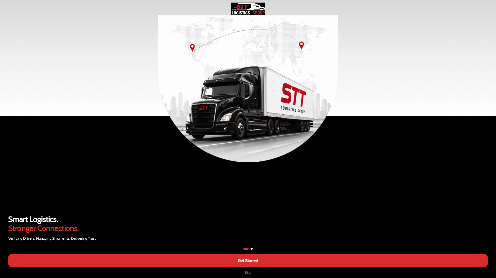 | 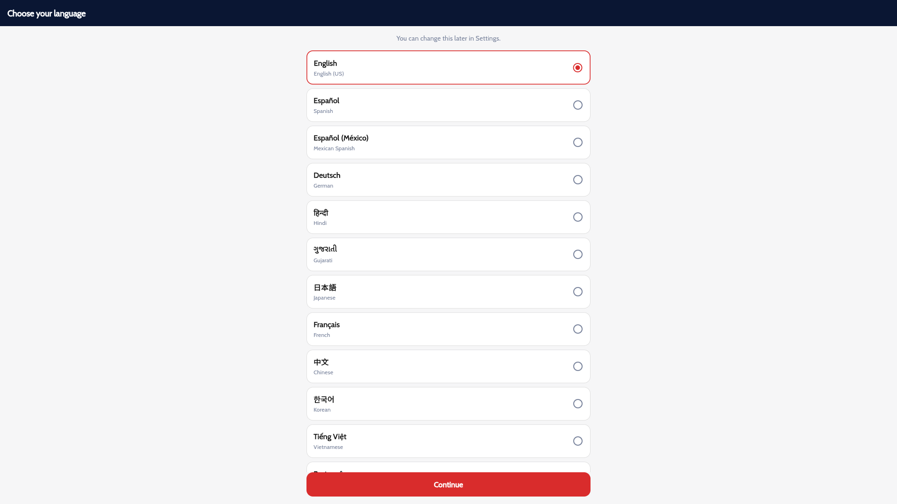 | 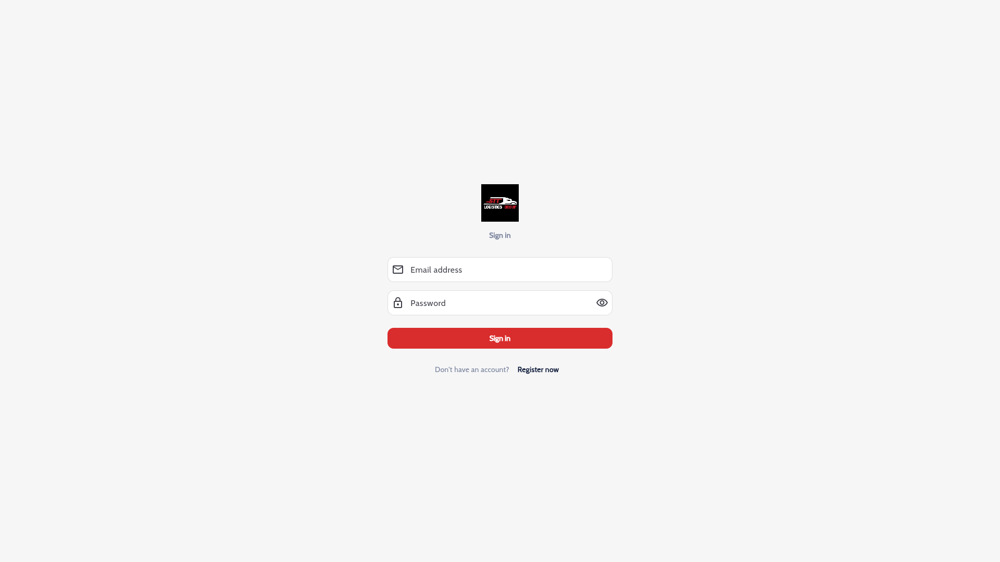 | 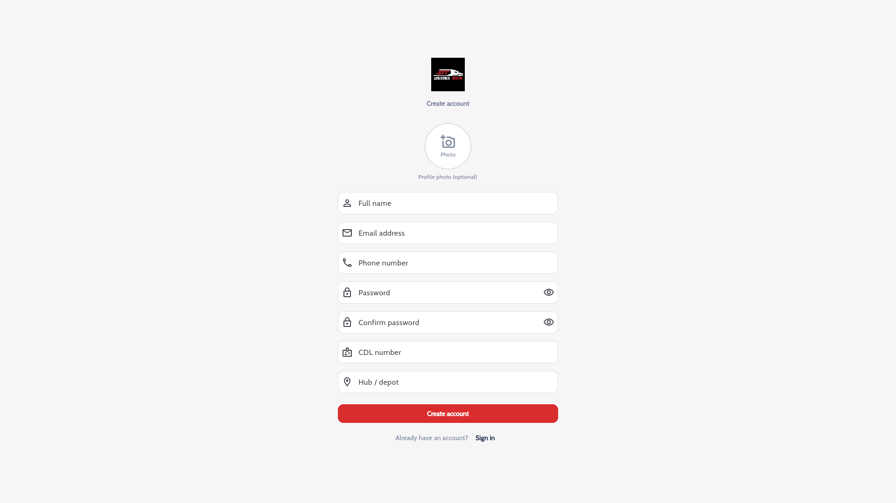 |

---

## Screenshots (iOS)

Captured from the iOS Simulator build.

### First-run & authentication

| Onboarding | Language | Sign in | Register |
|:---:|:---:|:---:|:---:|
| 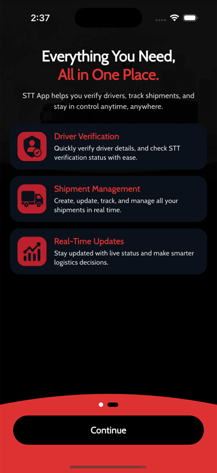 | 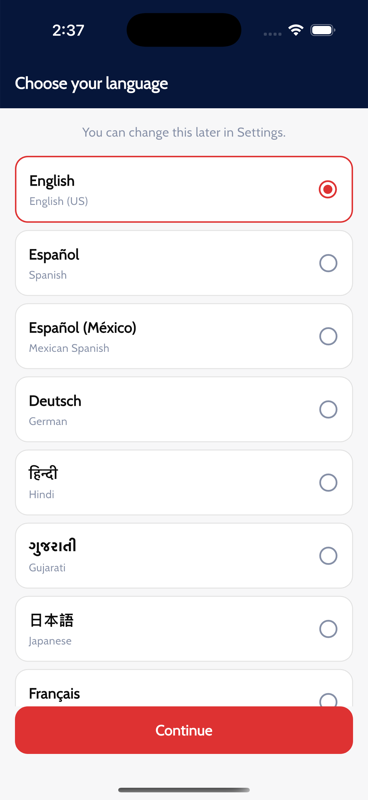 | 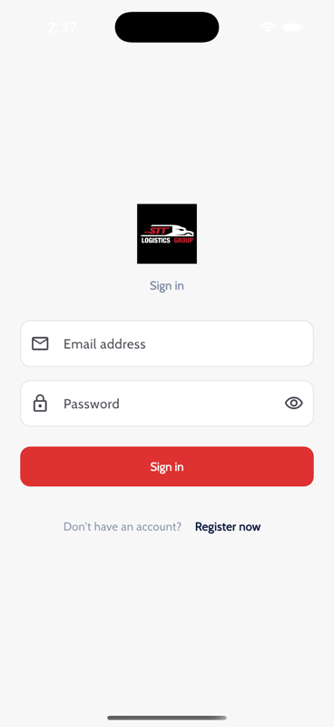 | 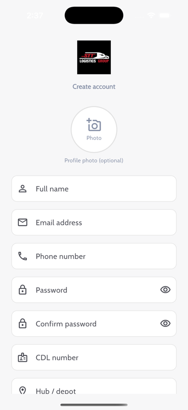 |

### Main app

| Home | Shipments | Add shipment |
|:---:|:---:|:---:|
| 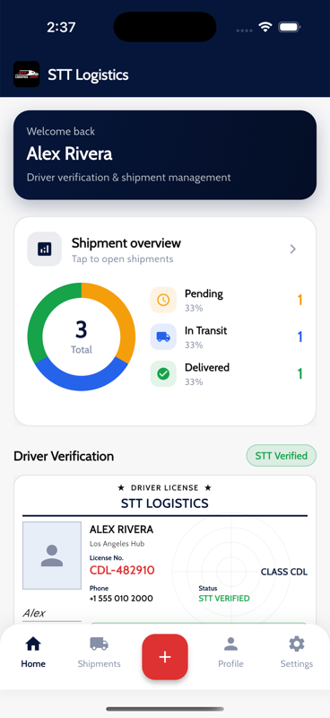 | 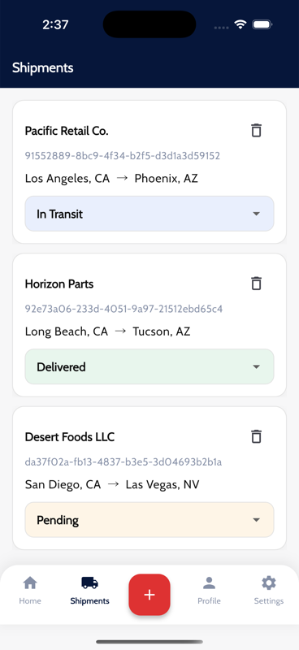 | 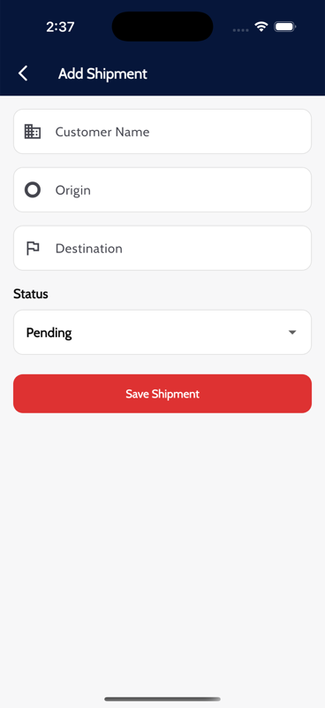 |

| Profile | Settings | Language (Settings) |
|:---:|:---:|:---:|
| 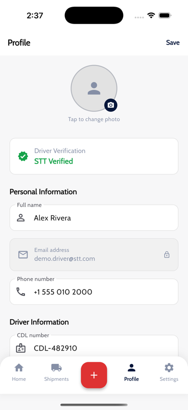 | 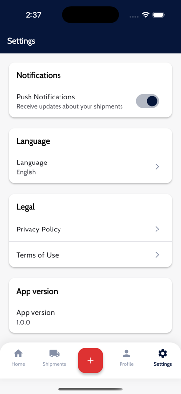 | 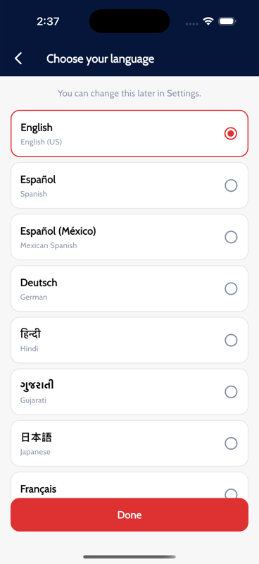 |

| Driver verification |
|:---:|
| 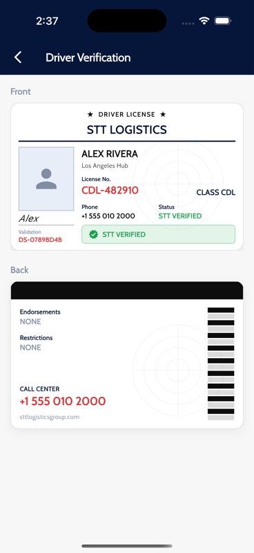 |

> Re-capture locally: `./tool/capture_ios_screenshots.sh`

---

## Features

### Onboarding & language (first launch only)
- Two-page branded onboarding (shown once per install)
- Language selection before login
- Preference remembered in Hive (`onboarding_completed`, `language_selected`)

### Authentication
- Email / password registration and sign-in
- Passwords stored as hashes
- Session restored after app restart
- Optional profile photo on register

### Home
- Personalized welcome header
- Shipment overview chart (total, pending, in transit, delivered)
- Driver verification card shortcut

### Shipments
- Create, edit, update status, delete
- Per-user isolation (users only see their own records)
- Data survives cold start
- Center **+** FAB opens the create form
- One-time FAB coach-mark tutorial on first shell visit

### Driver verification
- License-style card: name, CDL, hub, photo, STT status (Verified / Pending / Rejected)

### Profile & settings
- Edit name, phone, CDL, hub, photo
- Push notification toggle
- Change language anytime
- Privacy Policy & Terms of Use
- Logout

### Localization (15 locales)
English, Spanish, Mexican Spanish, German, Hindi, Gujarati, Japanese, French, Chinese, Korean, Vietnamese, Portuguese, Italian, Arabic, Filipino

UI copy uses Flutter `gen-l10n` (`lib/l10n/`).

---

## Firebase services

| Service | What it does in this app |
|---------|--------------------------|
| **Firebase Core** | Boots the Firebase app used by all other SDKs |
| **Analytics** | Screen views, funnel events (splash, auth, shipments), optional user id |
| **Crashlytics** | Crash / non-fatal reporting; tagged with user email when signed in |
| **Performance** | Traces key flows (e.g. splash bootstrap) |
| **Cloud Messaging (FCM)** | Push notifications; route-style deep links when a message includes a destination |
| **Local notifications** | Shows FCM alerts while the app is in the foreground |

Notifications can be disabled in **Settings**; `MessagingService` respects that flag.

> Auth and shipment **data** are local (Hive), not Firebase Auth / Firestore. Firebase here is for observability and messaging.

---

## Run locally

Requires Flutter **3.12+** and a configured Firebase project (`lib/firebase_options.dart`).

```bash
flutter pub get
flutter run
```

```bash
flutter analyze
flutter test
```

Capture README screenshots (iOS Simulator):

```bash
./tool/capture_ios_screenshots.sh
```

---

## Project layout

```text
lib/
  main.dart              Bootstrap (Firebase, Hive, services)
  app.dart               GetMaterialApp + localization delegates
  l10n/                  ARB files + generated AppLocalizations
  constants/             Colors, assets, analytics event names
  core/                  Validators, enums, failures, security
  data/                  Models, Hive API, providers, repositories
  modules/               Feature UI (auth, onboarding, shell, home, …)
  routes/                AppRoutes / AppPages
  services/              Auth, settings, analytics, messaging, …
  theme/                 Light theme
  widgets/               Shared UI (nav, fields, FAB tutorial, …)
docs/
  screenshots/           iOS captures
  screenshots/web/       Live web Hosting captures
  ARCHITECTURE.md        Layering notes
  CHANGELOG.md           Release notes
  STT_Logistics_App_Overview.pdf
```

---

## Architecture (short)

```text
View → Controller → Repository → Provider / AuthApi → Hive
```

### Why GetX

GetX was chosen as the app’s state-management and DI layer because it keeps screen logic in small controllers with reactive `Obx` rebuilds, while also covering routing and service registration in one lightweight package. That fit a multi-module Flutter app (auth, shell, shipments, settings) without the boilerplate of wiring separate navigation, DI, and state libraries. Controllers stay easy to unit-test and swap when a real backend replaces the local Hive APIs.

| Hive box | Contents |
|----------|----------|
| `users` | Accounts |
| `drivers` | CDL / hub / verification |
| `session` | Active login |
| `settings` | Notifications, locale, first-run flags |
| `shipments` | Per-user shipment records |

Details: [docs/ARCHITECTURE.md](docs/ARCHITECTURE.md)  
Client PDF: [docs/STT_Logistics_App_Overview.pdf](docs/STT_Logistics_App_Overview.pdf)

---

## Assumptions

Documented for the challenge review:

- **Auth is local mock** — email/password accounts live in Hive (`HiveAuthApi`), not Firebase Auth or a remote API. Suitable for demo / assessment; swap `AuthApi` when a backend is ready (screens can stay).
- **Shipments and driver data are on-device** — persisted in Hive boxes; no live database required by the brief.
- **Native product is portrait-only** — iOS / Android lock to portrait. The optional web demo is responsive and lives on the `web` branch / Firebase Hosting.
- **Brand assets** — logos and onboarding art are under `assets/images/` and `assets/images/onboarding/`.
- **Extra features beyond the PDF** — onboarding, 15 locales, Firebase Analytics/Crashlytics/FCM, and the hosted web build are intentional additions, not challenge blockers.

---


## License

Private — STT Logistics Group.
